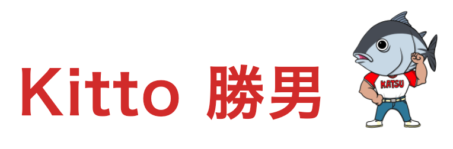
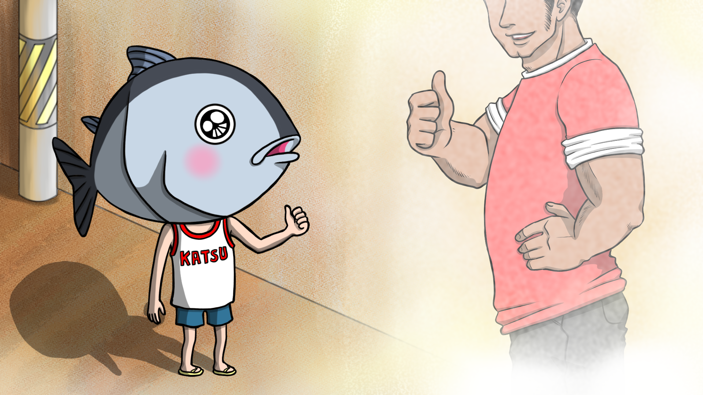
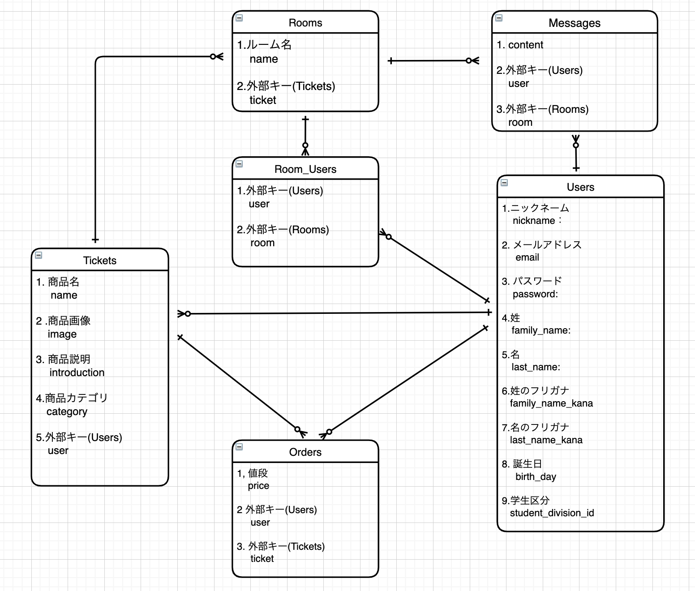

## :bookmark: アプリケーション名
 

  

### :bookmark:　アプリケーション概要

### 学生が視野を広げるため、社会人とお話しする時間を安価に購入できるサービスです。

 

### :bookmark: 制作背景
##### :one: 私は、教育学部を卒業しましたが、教員とはならず民間企業に進みました。振り返ると、身近な社会人が教員だったということが強く影響し、職業選択の視野が狭まっていました。学生の方にとって、気軽な価格で様々な職業の社会人とお話しできるサービスがあれば、より広い視野を持ち、進路を選択できる機会が増えると考え制作しました。

##### :two: 教育実習を通じ、学校では予想以上にスマホやSNSが浸透していました。今後この流れは加速するため、情報の入手だけで終わらず、実際に若い人たちが、視野を広げていく経験を職業選択という切り口から体験できるサービスを提供したいと思いました。
 
 

###   :two_men_holding_hands:ペルソナ   
##### :one:今の自分に少し自信が持て無かったり、目標とする将来像が明確にできない事に悩みつつも、未来に向かい成長したいという前向きな気持ちを秘めた、進路選択を控える高校生以上の学生。 
##### :two:目標とする将来像は明確になりつつも、その目標に近つくためのステップについてより明確にし、進路に向かい踏み出していこうとする学生。 

##   :thought_balloon: ユーザストーリー  

### :anguished: ユーザーが抱える課題  
##### :one: 興味のある進路についてのネットの情報は入手できたが、その情報が正しいのか分からず、漠然とした将来像しか描けていない。  
##### :two: 勉強と部活に追われ、忙しく時間が過ぎてしまい、自身の将来について見つめるきっけが得られていない。  

###  :raising_hand:ユーザの課題解決のための実装方針  
##### :one:学生に手が届く金額でサービスを提供する。価格はユーザの学生区分に応じて、高校生は1,000円、それ以上の学生は1,500円として 価格を自動設定することで、金銭的にも気軽に使ってもらえるようにする。
##### :two:他のチケットサービスよりも、職業というキーワードに重視したサービス設計をすることで、学生にとって将来を考えるための場を提供する体験できるサービスに近づける。 

###  :muscle: 工夫した点  
##### :one: チケット毎でのチャット機能の作成。

  

　　　

 

## 🌐 App URL

:link:https://kitto-katsuo.herokuapp.com/

## :key:Basic 認証番号

#### ID: admin
#### Password: 1234

### テスト用アカウント

#### :bust_in_silhouette: 「出品者用」

##### メールアドレス名: aaa111@gmail.com  
##### パスワード: aaa111

#### :busts_in_silhouette: 「購入者用」　

##### メールアドレス: bbb222@gmail.com  
##### パスワード: bbb222  

#### :credit_card: 購入用カード情報  
##### カード番号：4242424242424242  
##### 有効期限：12 月/20 年  
##### セキュリティコード：123

 

### :computer: 使用技術(開発環境)
#### Ruby / Ruby on Rails / Java Script / Html・Css / MySQL / GitHub / Heroku / AWS / Visual Studio Code / Trello / Draw.io /Adobe XD

 

### :pencil2: サイト設計 (ワイヤーフレーム)

  

##### 【詳細ページ(Adobe XD)】:link: https://xd.adobe.com/view/d9bd4993-7080-43d1-888f-5979c2d82faa-8cee/

 

### :open_file_folder:データベース設計

  

##### 【詳細ページ(Draw.io)】:link: https://drive.google.com/file/d/1nJHTUF4NiHQphii31tVkrSqc6k1B-Uon/view

 

## :book:テーブル設計

### Users テーブル

| Column              | Type    | Options                   |
| ------------------- | ------- | ------------------------- |
| nickname            | string  | null: false               |
| email               | string  | null: false ,unique: true |
| password            | string  | null: false               |
| family_name         | string  | null: false               |
| last_name           | string  | null: false               |
| family_name_kana    | string  | null: false               |
| last_name_kana      | string  | null: false               |
| birth_day           | date    | null: false               |
| student_division_id | integer | null: false               |

### Association

- has_many :tickets
- has_many :room_users
- has_many :rooms, through: room_users
- has_many :messages
- has_many :orders

### Tickets テーブル

| Column       | Type       | Options                         |
| ------------ | ---------- | ------------------------------- |
| name         | string     | null: false                     |
| image        | string     | null: false                     |
| introduction | text       | null: false                     |
| category_id  | integer    | null: false                     |
| user         | references | null: false , foreign_key: true |

### Association

- belongs_to :user
- has_many :rooms
- has_many :comments
- has_many :orders

### Orders テーブル

| Column | Type       | Options                        |
| ------ | ---------- | ------------------------------ |
| price  | integer    | null: false                    |
| user   | references | null: false ,foreign_key: true |
| ticket | references | null: false ,foreign_key: true |

### Association

- belongs_to :ticket
- belongs_to :user

### Room_users テーブル

| Column | Type       | Options                        |
| ------ | ---------- | ------------------------------ |
| user   | references | null: false ,foreign_key: true |
| ticket | references | null: false ,foreign_key: true |
| room   | references | null: false ,foreign_key: true |

### Association

- belongs_to :room
- belongs_to :user

### Rooms テーブル

| Column | Type       | Options                        |
| ------ | ---------- | ------------------------------ |
| name   | string     |                                |
| ticket | references | null: false ,foreign_key: true |

### Association

- has_many :room_users
- has_many :users, through: room_users
- has_many :tickets, through: room_users
- has_many :messages

### Messages テーブル

| Column  | Type       | Options                        |
| ------- | ---------- | ------------------------------ |
| content | string     | null: false                    |
| user    | references | null: false ,foreign_key: true |
| room    | references | null: false ,foreign_key: true |

### Association

- belongs_to :room
- belongs_to :user
